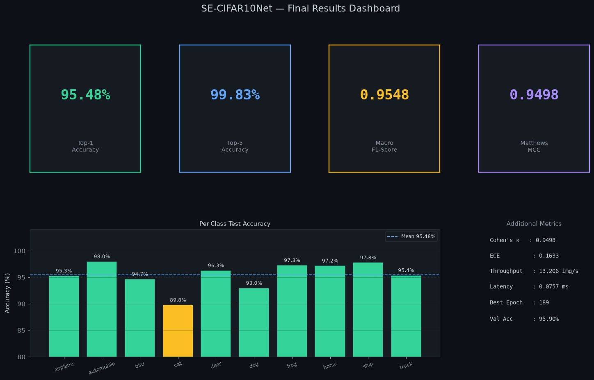

# Portfolio Guide — Push, Edit, Host

This is the complete reference for maintaining this site: getting it onto
GitHub, making it live for free, and editing every part of it going forward.
Keep this file — you'll come back to it.

**Quick orientation:** this is a plain HTML/CSS/JS site. No framework, no
`npm install`, no build step for the homepage. The only tool involved is a
small Python script that generates the six project pages from one shared
template, so their nav/footer/theme code can never drift out of sync with
each other. You'll use it any time you touch a project page.

---

## Part 1 — Push this to GitHub

### 1.1 Check you have Git

```bash
git --version
```

If that errors, install Git first: [git-scm.com/downloads](https://git-scm.com/downloads).
On Windows, install **Git Bash** and run every command below inside it.

### 1.2 Tell Git who you are (first time only, on this machine)

```bash
git config --global user.name "Md. Mehenuf Hossain Bhuiyan"
git config --global user.email "mehenuf@gmail.com"
```

### 1.3 Create the GitHub repository

1. Go to [github.com/new](https://github.com/new).
2. **Repository name** — this choice decides your URL, so pick deliberately:
   - Name it exactly `mehenuf.github.io` → your site publishes at
     `https://mehenuf.github.io/` (cleanest possible URL, no sub-path).
   - Name it anything else, e.g. `portfolio` → it publishes at
     `https://mehenuf.github.io/portfolio/`. Both work identically — every
     link in this site is relative, so nothing needs to change either way.
3. Set it to **Public** (GitHub Pages is free for public repositories).
4. **Do not** tick "Add a README", "Add .gitignore", or "Choose a license" —
   this folder already has all of that. An empty repo makes the first push
   cleaner.
5. Click **Create repository** and leave the next page open — it shows the
   exact remote URL you'll need in a moment.

### 1.4 Push the folder

Open a terminal **inside the `portfolio` folder** (the one containing
`index.html`) and run:

```bash
git init
git branch -M main
git add .
git commit -m "Initial portfolio"
git remote add origin https://github.com/mehenuf/mehenuf.github.io.git
git push -u origin main
```

Replace the URL on the `git remote add` line with the one GitHub showed you
in step 1.3 if you named the repo something else.

### 1.5 Authenticate

GitHub no longer accepts your account password over the command line. If
`git push` asks for one, use a **Personal Access Token** instead:

1. [github.com/settings/tokens](https://github.com/settings/tokens) → **Generate new token (classic)**.
2. Tick the `repo` scope, set an expiry, generate it, and **copy it now** —
   it's shown once.
3. When Git prompts for a password, paste the token instead.
4. Optional but recommended: install a credential helper so you're not
   prompted every time —
   ```bash
   git config --global credential.helper store
   ```
   (macOS/Windows users can instead use **GitHub Desktop**, which handles
   auth with a login button — see 1.7 below if you'd rather avoid the
   command line entirely.)

### 1.6 Confirm it worked

Refresh your repository page on GitHub. You should see `index.html`,
`assets/`, `projects/`, and everything else listed.

### 1.7 Prefer a GUI? Use GitHub Desktop instead of steps 1.4–1.5

1. Install [desktop.github.com](https://desktop.github.com) and sign in.
2. **File → Add local repository** → select the `portfolio` folder.
3. It'll offer to initialise Git for you — accept.
4. **Publish repository** (top bar) → name it, keep it Public → **Publish**.

Everything below still applies either way — GitHub Desktop just replaces
the `git add` / `commit` / `push` commands with buttons.

---

## Part 2 — Make it live, free (GitHub Pages)

The repo already ships with `.github/workflows/deploy.yml`, which is a
GitHub Actions workflow that publishes the site automatically. You only
need to flip one switch.

### 2.1 Turn on Pages

1. On your repo page: **Settings → Pages**.
2. Under **Build and deployment → Source**, choose **GitHub Actions** (not
   "Deploy from a branch").
3. That's it — no further config. The workflow that's already in the repo
   takes over from here.

### 2.2 Watch the first deploy

1. Click the **Actions** tab. You should see a run in progress (triggered by
   the push you just did, or start one manually with **Run workflow** if
   nothing's listed).
2. It takes about 1–2 minutes. A green check means it's live.
3. Your URL is shown in **Settings → Pages** at the top once the first
   deploy finishes — `https://mehenuf.github.io/` or
   `https://mehenuf.github.io/portfolio/` depending on what you named the
   repo.

### 2.3 Every future update goes live automatically

From here on, any time you `git push` to the `main` branch, the site
redeploys on its own within about a minute. Nothing else to run.

### 2.4 Optional — a custom domain

If you buy a domain later:

1. **Settings → Pages → Custom domain** → enter it → Save.
2. At your domain registrar, add:
   - Four `A` records (for the bare domain) pointing to:
     `185.199.108.153`, `185.199.109.153`, `185.199.110.153`, `185.199.111.153`
   - A `CNAME` record for `www` pointing to `mehenuf.github.io`
3. Back in **Settings → Pages**, tick **Enforce HTTPS** once it's available
   (can take up to 24 hours after DNS propagates). GitHub issues the
   certificate for free — no separate purchase needed.

### 2.5 Troubleshooting

| Symptom | Cause | Fix |
|---|---|---|
| Site loads with no styling at all | `.nojekyll` missing or not committed | Confirm it exists at the repo root: `ls -la` should show it. If missing, `touch .nojekyll`, commit, push. |
| 404 on the whole site | Pages source not set to Actions | Settings → Pages → Source → GitHub Actions |
| Actions tab shows a red ✗ | Pages wasn't enabled before the workflow first ran | Enable Pages (2.1), then re-run the failed job from the Actions tab |
| Changes pushed but site looks the same | Browser cache, or the Actions run hasn't finished | Hard refresh (Ctrl/Cmd+Shift+R); check the Actions tab shows a green check |
| Images missing on the live site but fine locally | Image files weren't committed (large binary files sometimes get skipped by accident) | `git status` — if `assets/img/...` shows as untracked, `git add assets/ -f`, commit, push |
| A project page 404s | You edited `projects/*.html` directly instead of regenerating | See Part 6 — always run `python3 build_projects.py` after editing `build_projects.py` |

### 2.6 Alternative: Vercel

Also free, no Actions file needed:

1. [vercel.com](https://vercel.com) → **Add New… → Project** → import the
   GitHub repo.
2. Framework preset: **Other**. Leave build command and output directory
   blank — there's nothing to build.
3. **Deploy** → you get a live `*.vercel.app` URL in under a minute, and it
   redeploys automatically on every push, same as GitHub Pages.

---

## Part 3 — The site map

```
portfolio/
├── index.html                 ← the homepage. Hand-written, edit directly.
├── projects/                  ← GENERATED. Never edit these files directly.
│   ├── cifar10-classifier.html
│   ├── patient-care-operating-system.html
│   ├── credit-scoring-blockchain.html
│   ├── corn-leaf-xai.html
│   ├── perfume-store-rdbms.html
│   └── flood-alert-system.html
├── build_projects.py          ← generates everything in projects/. Edit THIS.
├── assets/
│   ├── css/style.css          ← every colour, font, spacing, animation
│   ├── js/main.js             ← theme toggle, scroll reveals, lightbox, etc.
│   └── img/                   ← case-study screenshots and charts
│       ├── cifar/
│       └── credit/
├── .github/workflows/deploy.yml   ← the auto-deploy robot (don't touch)
├── .nojekyll                  ← tells GitHub Pages not to run Jekyll (don't touch)
├── robots.txt
└── README.md
```

**The one rule that matters most:** `index.html` is safe to hand-edit.
Every file inside `projects/` is *generated* by `build_projects.py` — if
you edit one of those files directly, your edit will be silently erased
the next time anyone runs the generator. Always edit `build_projects.py`
and re-run it.

Homepage sections, in order, with their `id` (useful for the nav links and
for finding things with your editor's search):

| Section | `id` | What's in it |
|---|---|---|
| Hero | `#top` | Name, tagline, role list, summary, photo placeholder, fact strip |
| About | `#about` | Longer bio, "roles I'm looking for" panel, interest chips |
| Timeline | `#timeline` | Education only — SSC, HSC, BSc |
| Research Experience | `#research` | Undergrad research + capstone, own mini-timeline |
| Skills | `#skills` | Core-stack row + categorised skill cards |
| Projects | `#work` | The six project cards |
| Publications | `#publications` | The two paper cards |
| Leadership | `#leadership` | Extracurricular / leadership cards |
| Contact | `#contact` | CTA panel + buttons |
| Footer | — | Copyright + link row |

---

## Part 4 — Editing each part of the homepage

Everything in this part happens in **`index.html`** directly. Open it in
any text editor (VS Code recommended) and use Find (Ctrl/Cmd+F) with the
search text given below.

### 4.1 Name, tagline, and role list (hero)

Search for `Md. Mehenuf<br>Hossain Bhuiyan`. Nearby you'll find:

```html
<h1>Md. Mehenuf<br>Hossain Bhuiyan</h1>
<p class="tagline">I build ML systems, then make them <span class="accent">explain themselves.</span></p>
<p class="role-line">
  AI &nbsp;·&nbsp; Machine Learning &nbsp;·&nbsp; AI Automation &amp; Operations<br>
  Data Analytics &nbsp;·&nbsp; Data Science
</p>
```

Edit any of that text directly. The `<span class="accent">` wrapper is what
colours a phrase violet — move it to wrap a different phrase if you want.

### 4.2 The professional summary

Search for `Computer Science &amp; Engineering graduate`. That's the
paragraph under the role list. Plain text, edit freely.

### 4.3 The fact strip (the four tiles under the hero)

Search for `class="facts" data-stagger`. Each tile is one line:

```html
<div class="fact"><div class="k">B.Sc. CSE</div><div class="v">North South University — specialisation in AI &amp; Data Science</div></div>
```

`k` is the bold headline, `v` is the caption underneath. Add, remove, or
edit tiles the same way — the grid re-flows automatically (4 columns on
desktop, 2 on tablet, 1 on narrow phones).

### 4.4 Your photo

Search for `class="photo-frame"`. Right now it's a placeholder:

```html
<div class="hero-figure reveal">
  <div class="photo-frame">
    <div class="icon">...</div>
    <div class="label">Add your photo here</div>
    <div class="sub">Square or 4:5 headshot recommended</div>
  </div>
</div>
```

Replace the whole `.photo-frame` div with an image:

```html
<div class="hero-figure reveal">
  
</div>
```

Put the actual image file at `assets/img/profile/headshot.jpg` (create the
`profile` folder). Use a square or 4:5 portrait crop, roughly 800–1200px on
the long edge — no need to go bigger, it only ever displays at a few
hundred pixels.

### 4.5 About section — bio and "roles I'm looking for"

Search for `id="about"`. The bio is plain `<p>` tags — edit freely. The
panel to its right:

```html
<div class="seeking reveal">
  <h3>Roles I'm looking for</h3>
  ...
  <li><svg ...></svg>Artificial Intelligence</li>
```

Each `<li>` is one role. Copy a line and change the text to add another;
delete a line to remove one. Leave the `<svg>` checkmark as-is — it's the
same icon on every line by design.

Below that, `class="chip-row" data-stagger` holds the small interest tags
(Deep Learning, FinTech, etc.) — same pattern, one `<span class="chip">`
per tag.

### 4.6 Timeline (education)

Search for `id="timeline"`. Each entry is a `.t-item`:

```html
<div class="t-item">
  <div class="t-node"></div>
  <span class="t-when">Apr 2021 – Jun 2026</span>
  <h3>B.Sc. in Computer Science and Engineering</h3>
  <div class="t-org">North South University · Specialisation: Artificial Intelligence &amp; Data Science</div>
  <p>Relevant coursework: ...</p>
  <div class="t-note">Certificates &amp; training: ...</div>
</div>
```

This section is deliberately education-only (SSC/HSC/BSc) — extracurricular
and research entries live in their own sections (4.7, 4.9) so they don't
crowd the formal education record. Copy a `.t-item` block to add a degree;
delete one to remove it. Order is whatever order they appear in the file —
put the most recent one first.

### 4.7 Research Experience

Search for `<!-- ================= RESEARCH EXPERIENCE`. Same `.t-item`
structure as the timeline above, just a separate `.timeline` container with
its own scroll-linked progress line. Add or edit entries the same way as
4.6.

### 4.8 Skills

Search for `id="skills"`. Two parts:

**Core stack** (the row of icon tiles at the top) — search for
`class="core-stack"`:

```html
<div class="core-item"><div class="tile"><i class="devicon-python-plain colored"></i></div><span>Python</span></div>
```

To add a tool, copy this line and change the devicon class and label. Find
icon class names at [devicon.dev](https://devicon.dev) — search the tool
name, click it, copy the class shown (e.g. `devicon-docker-plain`). If a
tool has no devicon (like n8n or ClickUp did), use a text tile instead:

```html
<div class="core-item"><div class="tile mono" style="font-size:14px;font-weight:700;color:var(--violet-deep);">XY</div><span>Tool Name</span></div>
```

**Category cards** — search for `class="skills-grid"`. Each card:

```html
<div class="skill-card">
  <div class="head">
    <div class="head-main">
      <div class="skill-icon"><svg>...</svg></div>
      <h3>Programming Languages</h3>
    </div>
    <span class="skill-count"></span>
  </div>
  <div class="chip-row">
    <span class="chip"><i class="devicon-python-plain colored"></i>Python</span>
    <span class="chip">Java</span>
    ...
  </div>
</div>
```

To add a skill to an existing category, add another `<span class="chip">`
inside its `.chip-row` — the number badge (`.skill-count`) updates itself
automatically (it's computed by JavaScript from however many chips are
actually there, so you never need to touch it). To add a whole new
category, copy an entire `.skill-card` block, change the heading and
icon SVG, and drop it into `.skills-grid` — the layout re-flows on its own.

### 4.9 Projects grid

Search for `id="work"`. Each project is one `<a class="proj-card">` block.
See **Part 6** below — adding a project is involved enough to get its own
section.

To just **reorder** existing cards, cut and paste whole `<a class="proj-card">
...</a>` blocks into a different order — nothing else needs to change.

To **edit** an existing card's summary text or tags without touching the
project page itself, everything you need is right there in `index.html`:

```html
<div class="row-top"><h3>CIFAR-10 Classification — SE-ResNet, CutMix &amp; Calibration</h3><span class="proj-metric">95.48% top-1</span></div>
<p>A custom SE-ResNet trained from scratch...</p>
<div class="proj-tags"><span>PyTorch</span><span>CutMix</span><span>Focal Loss</span><span>Gradio</span></div>
```

### 4.10 Publications

Search for `id="publications"`. Each `.paper-card` is self-contained —
title, description, meta tags, and a "View paper" link. Copy the whole
block to add a new publication.

### 4.11 Leadership & extracurricular

Search for `id="leadership"`. Each `.lead-card` is one entry — year, title,
organisation, description. Copy/edit/delete the same way as everything
above.

### 4.12 Contact section and footer

Search for `id="contact"`. The buttons are plain `<a class="btn ...">` tags
— edit the `href`, icon, or label directly. The footer (search
`class="footer"`) has a matching, shorter link row — if you add a link in
Contact, add the same one there for consistency.

---

## Part 5 — Adding or replacing images

### 5.1 Case-study screenshots (project pages)

Screenshots live in `assets/img/<project-name>/` and are wired into a page
through the `gallery()` helper inside **`build_projects.py`** — never by
editing a project HTML file directly.

**To add a screenshot:**

1. Drop the image file into `assets/img/<project-name>/`, e.g.
   `assets/img/corn/gradcam-overlay.jpg`. JPEG at ~80–85% quality, resized
   to roughly 1200–1500px on the long edge, keeps file size sane — most
   image editors and `sips`/ImageMagick can do this in one step:
   ```bash
   # macOS/Linux example using ImageMagick
   magick input.png -resize 1500x -quality 84 assets/img/corn/gradcam-overlay.jpg
   ```
2. Open `build_projects.py`, find that project's `PAGES["...html"] = dict(...)`
   entry, and find (or add) a `gallery([...])` call inside its `body=(...)`.
   Each entry is a 4-item tuple:
   ```python
   gallery([
       ("../assets/img/corn/gradcam-overlay.jpg",   # path, relative to projects/
        "Grad-CAM heatmap over a diseased leaf",      # alt text (accessibility)
        "Grad-CAM overlay",                           # bold caption title
        "Peak activation sits on the lesion, not the background."),  # caption body
   ])
   ```
   If the project currently has a "Note on assets" placeholder paragraph
   instead of a gallery (corn-leaf, perfume-store, and flood-alert all do,
   since those repos don't ship exported images), replace that whole
   `section(...)` call with a `gallery([...])` call — copy the exact
   pattern used in the CIFAR-10 entry as a template.
3. Regenerate and check it locally (Part 7):
   ```bash
   python3 build_projects.py
   ```

Image dimensions are read automatically from the file at build time and
baked into the HTML as `width`/`height` attributes, so lazy-loading never
causes layout shift — you don't need to specify them yourself.

### 5.2 The hero photo

Covered in 4.4 above.

### 5.3 Project card icons on the homepage

Each project card in `index.html` has a small hand-drawn SVG icon rather
than a screenshot (`class="glyph"`), so the six cards read as one
consistent set instead of six different image crops. If you'd rather use a
real thumbnail image for a given card, replace its `<svg class="glyph">...
</svg>` block with an ``:

```html
<div class="proj-media">
  
</div>
```

---

## Part 6 — Adding a brand-new project

This is the most involved edit, so it gets full step-by-step treatment.
There are two things to update: `build_projects.py` (generates the case
study page) and `index.html` (adds the card to the grid).

### 6.1 Gather what you need

- A project title, one-line summary, and a "why does this project exist"
  problem statement
- 3–5 real, sourced metrics (never invent numbers)
- A GitHub repo URL, if there is one
- Screenshots or charts, if you have them (see Part 5)

### 6.2 Add the entry to `build_projects.py`

Open `build_projects.py` and find the `PAGES` dictionary — six entries,
each starting with `PAGES["something.html"] = dict(`. Copy one whole entry
as your template (the CIFAR-10 one is the most complete example) and change
every field. Here's what each one controls:

```python
PAGES["your-new-project.html"] = dict(
    title="Short Page Title",                    # <title> tag + browser tab
    desc="One-sentence meta description.",        # SEO / link-preview text
    eyebrow="Course or context · Date range",      # small label above the headline
    headline="The one punchy sentence about it.",  # the big H1
    sub="A slightly longer supporting sentence.",  # the paragraph under the H1
    tags=tags(["Tool1", "Tool2", "Tool3"]),        # small pills under the sub
    primary_cta=github_cta("https://github.com/mehenuf/your-repo"),
    extra_cta='<a class="btn btn-ghost" href="../index.html#contact">Ask me about this</a>',
    facts=facts([
        ("95%", "What this number means"),
        ("3x", "What this number means"),
        ("0", "What this number means"),
        ("7", "What this number means"),
    ]),
    stack=chips(["Python", "PyTorch", "..."]),      # "Built with" row at the bottom
    prev_href="existing-project.html", prev_label="Existing Project Name",
    next_href="existing-project.html", next_label="Existing Project Name",
    body=(
        section("The problem", "Headline", "Supporting sentence.",
                block(["<b>Bolded point.</b> Explanation.", "..."])) +
        section("The approach", "Headline", "",
                pipeline([
                    ("Step name", "One sentence about this step."),
                    ("Step name", "One sentence about this step."),
                ])) +
        section("Results", "Headline", "",
                findings([
                    ("TAG", "Finding headline", "Finding explanation."),
                    ("TAG", "Finding headline", "Finding explanation."),
                ]))
    ),
)
```

If there's no public repo for the project (like the Patient Care Operating
System), use `primary_cta=f'<a class="btn btn-primary" href="mailto:...">Request the write-up</a>'`
instead of `github_cta(...)` — see that entry in the file for the exact
pattern.

**Available body building-blocks** (mix and match, in any order, joined
with `+`):

| Helper | Use it for |
|---|---|
| `block([...])` | A bulleted list, each item optionally starting `<b>bold</b>` |
| `pipeline([(name, desc), ...])` | A left-to-right numbered process diagram |
| `findings([(tag, headline, body), ...])` | Tagged result cards |
| `table(headers, rows, caption="")` | A data table, with `<span class="best">`/`<span class="warn">`/`<span class="num">` for highlighted cells |
| `gallery([(src, alt, title, caption), ...])` | An image grid with lightbox (see Part 5) |

### 6.3 Wire up the neighbouring pages' prev/next links

Your new page's `prev_href`/`next_href` point at two existing pages — now
update **those two pages** so the chain connects both directions. Find
whichever page you set as `prev_href` and change its `next_href` (and
`next_label`) to point at your new page; do the same for the page you set
as `next_href`, changing its `prev_href`. (Look at how the existing six
entries link to each other for the exact pattern — it's a simple loop.)

### 6.4 Regenerate

```bash
python3 build_projects.py
```

This rewrites everything in `projects/` from scratch. You should see your
new file listed in the output alongside the six existing ones.

### 6.5 Add the card to the homepage grid

Open `index.html`, search for `id="work"`, and copy one whole
`<a class="proj-card reveal" href="projects/....html">...</a>` block
(anywhere in the grid — order is just document order). Change:

- `href` to `projects/your-new-project.html`
- The `<svg class="glyph">` — either draw a new simple icon (keep the
  same visual language: neutral `var(--ink-soft)` strokes with one
  `var(--violet-deep)` accent, no other colours — see 7.1) or swap in an
  `` per 5.3
- The `<h3>`, `<span class="proj-metric">`, `<p>`, and `<span>` tags inside
  `.proj-tags`

### 6.6 Test locally, then push

See Part 7, then Part 1.4 onward to commit and push. The site redeploys
automatically.

---

## Part 7 — Testing changes locally before you push

Never rely on double-clicking `index.html` — opening files directly over
`file://` breaks a few things (relative image paths, fonts). Run a tiny
local server instead:

```bash
cd portfolio
python3 -m http.server 8000
```

Then open `http://localhost:8000` in your browser. Leave that command
running in its terminal tab while you edit — just refresh the browser
after each change. Press Ctrl+C in that terminal when you're done.

If you changed anything in `build_projects.py`, remember to run
`python3 build_projects.py` **before** refreshing, or you'll be looking at
stale pages.

**Quick self-check before pushing anything:**

```bash
# Confirm no HTML tag got left unclosed
python3 -c "
from html.parser import HTMLParser
p = HTMLParser(); p.feed(open('index.html', encoding='utf-8').read())
print('parsed OK')
"

# Confirm the JS still has valid syntax
node --check assets/js/main.js && echo "JS OK"
```

If either of those errors out, you've got a typo (usually an unclosed tag
or a stray quote) — fix it before pushing.

---

## Part 8 — Customising the design

### 8.1 Colours

Everything in the site pulls from CSS custom properties at the top of
**`assets/css/style.css`**. Change a token once, and it cascades
everywhere that colour is used — nav, buttons, timeline, cards, tags.

```css
--violet:#5B4FE9;        /* the one interactive/brand accent — links, buttons, active states */
--violet-deep:#4338CA;   /* darker variant — hover states, headings-on-accent */
--violet-tint:#EEEDFC;   /* pale background wash for badges */

--teal:#0EA894;          /* reserved for small tag/metric chips only — not decorative */
--teal-deep:#0A7C6C;
--teal-tint:#E2F7F3;

--rose:#C4425A;           /* negative/regressed data points in tables only */
--rose-tint:#FBE9EC;

--ink:#12141C;            /* body text */
--paper:#F5F6F8;          /* page background */
--panel:#FFFFFF;          /* card background */
```

There's a matching set under `[data-theme="dark"]` a little further down —
edit both if you're changing the palette, or just the light set if you're
only tweaking accent shades (dark mode inherits the same *role* for each
token, just different values).

**Design principle already baked in, worth keeping:** one accent colour
(violet) used solidly, no gradients spanning multiple hues. If you
introduce a second accent, give it one narrow job (like teal's "small tag"
role) rather than using it decoratively — that's what keeps the site from
reading like a "rainbow."

### 8.2 Fonts

Three font families, declared once each:

```css
font-family:'Sora',sans-serif;           /* headings */
font-family:'Inter',...;                  /* body text (site default) */
font-family:'JetBrains Mono',monospace;   /* labels, tags, dates, code-like text */
```

To swap one out: change the `<link href="https://fonts.googleapis.com/css2?family=...">`
tag in the `<head>` of **every** HTML file (index + 6 project pages — for
the project pages, edit the `SHELL` string near the top of
`build_projects.py` instead, then regenerate), and update the matching
`font-family` declarations in `style.css`.

### 8.3 Animation timing

All motion timing is centralised at the top of `style.css`:

```css
--dur-press:  160ms;   /* button press feedback */
--dur-hover:  180ms;   /* colour/hover transitions */
--dur-ui:     220ms;   /* card lifts, menus */
--dur-modal:  250ms;   /* lightbox */
--dur-reveal: 520ms;   /* scroll-in entrance (marketing-tier, deliberately slower) */
```

Change a value here rather than hunting down individual `transition:`
rules — nearly everything references these tokens.

---

## Part 9 — The standard workflow, going forward

Once it's live, this is the loop for every future change:

1. **Edit.** `index.html` directly for anything on the homepage;
   `build_projects.py` for anything on a project page.
2. **Regenerate, if you touched `build_projects.py`:**
   ```bash
   python3 build_projects.py
   ```
3. **If you edited `assets/css/style.css` or `assets/js/main.js` directly** —
   bump the cache-busting number. Every HTML file loads them as
   `style.css?v=2` and `main.js?v=2`; browsers (and GitHub's CDN) cache
   files aggressively, so without changing that number a visitor's browser
   can keep showing the *old* CSS or JS even after you've pushed new ones —
   this is exactly what happened once already. Find-and-replace `?v=2` with
   `?v=3` (then `?v=4` next time, and so on) across `index.html` and inside
   the `SHELL` template near the top of `build_projects.py`, then
   regenerate:
   ```bash
   python3 build_projects.py
   ```
   You only need to do this for CSS/JS edits — editing HTML content alone
   doesn't need a version bump.
4. **Preview locally** (Part 7):
   ```bash
   python3 -m http.server 8000
   ```
5. **Commit and push:**
   ```bash
   git add .
   git commit -m "Describe what changed"
   git push
   ```
6. **Done.** The site redeploys automatically within about a minute. Hard
   refresh (Ctrl/Cmd+Shift+R) when you check it live — even with the
   version bump, your *own* browser may still hand you a cached copy of the
   page itself for a few seconds after deploy.

---

## Quick reference

```bash
# Preview locally
python3 -m http.server 8000

# Rebuild all project pages after editing build_projects.py
python3 build_projects.py

# Ship an update
git add .
git commit -m "..."
git push
```

| I want to... | Edit this | Section in this guide |
|---|---|---|
| Change my name, tagline, or summary | `index.html` | 4.1, 4.2 |
| Add my photo | `index.html` | 4.4 |
| Edit education | `index.html` | 4.6 |
| Edit research experience | `index.html` | 4.7 |
| Add a skill or tool | `index.html` | 4.8 |
| Reorder or edit an existing project card | `index.html` | 4.9 |
| Add a screenshot to a case study | `build_projects.py` + image file | 5.1 |
| Add a whole new project | `build_projects.py` + `index.html` | 6 |
| Change colours or fonts | `assets/css/style.css` | 8 |
| Push an update live | terminal | 9 |
